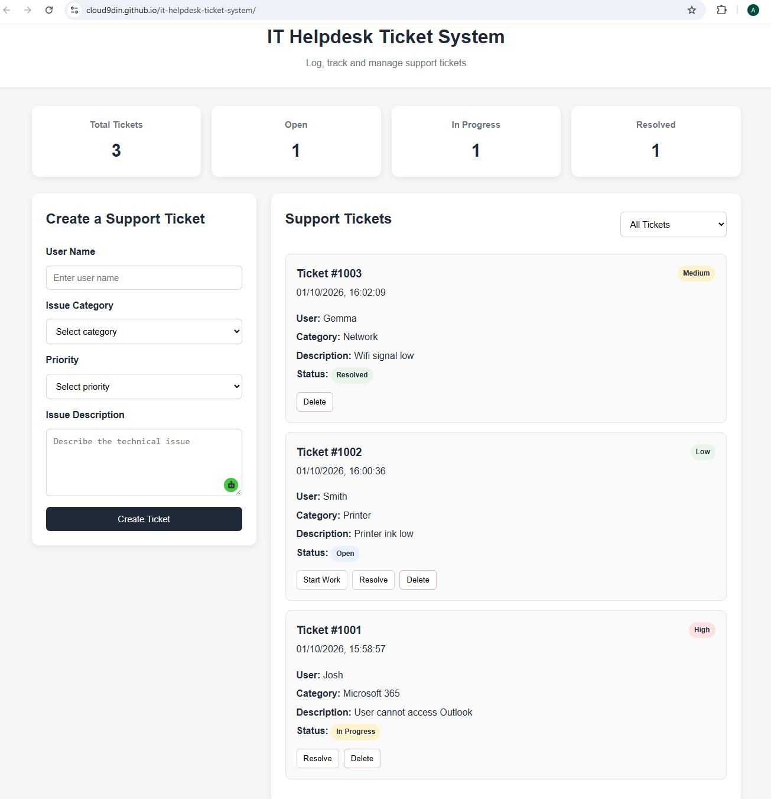

# IT Helpdesk Ticket System

A simple helpdesk ticket management system built with HTML, CSS and JavaScript.

The project demonstrates a basic IT support workflow where users can create, track and manage support tickets.

## Screenshot

## Live Demo

https://cloud9din.github.io/it-helpdesk-ticket-system/

## Features

- Create support tickets
- Automatic ticket numbering
- Ticket priority levels
- Open, In Progress and Resolved statuses
- Ticket filtering
- Dashboard counters
- Delete tickets
- Local browser storage
- Responsive layout

## Technologies Used

- HTML5
- CSS3
- JavaScript
- DOM Manipulation
- Local Storage
- GitHub Pages

## Example Support Categories

- Hardware
- Software
- Microsoft 365
- Network
- Password
- Printer
- Account Access

## What I Learned

This project helped me practise:

- JavaScript DOM manipulation
- Managing data with Local Storage
- Creating and updating ticket statuses
- Filtering data
- Building a responsive user interface
- Using Git and GitHub
- Deploying a project with GitHub Pages

## Future Improvements

- Search tickets
- Edit existing tickets
- Add technician assignment
- Add SLA tracking
- Add user authentication
